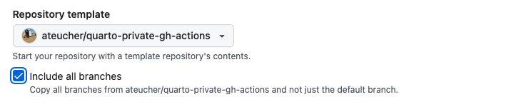
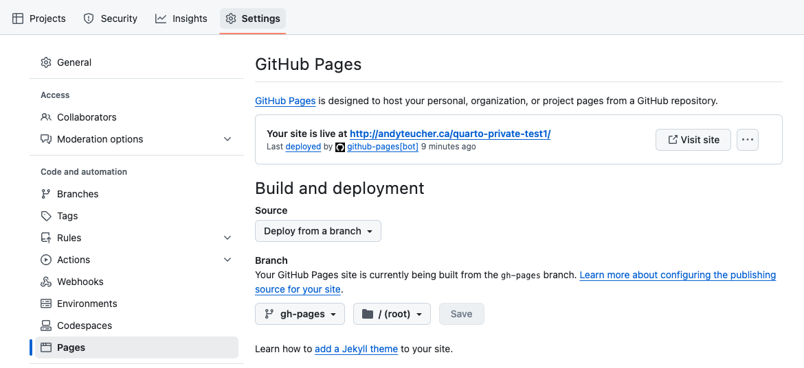
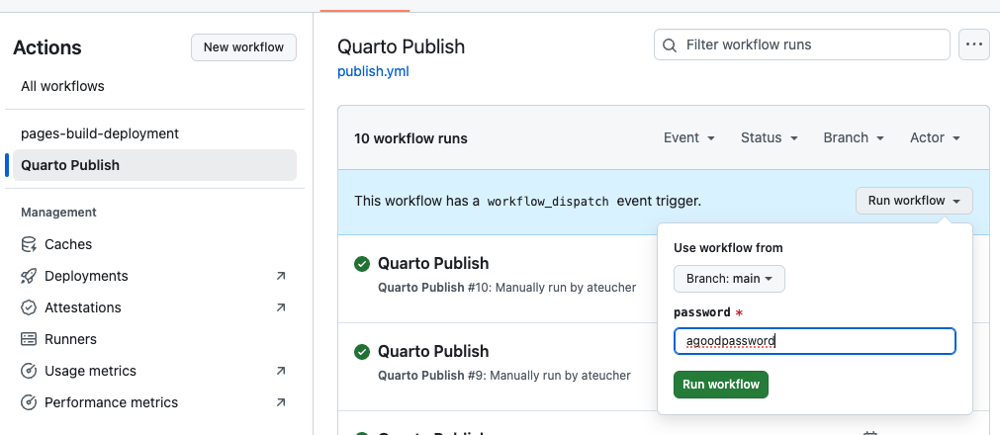
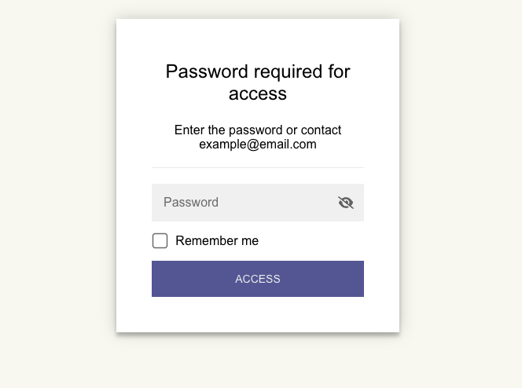

# Create a password-protected Quarto website

This is a Quarto website template with password protection, using the
[staticryptR](https://github.com/nikitoshina/staticryptR) package.

This will encrypt the rendered website and put it behind a simple password
prompt. It does not encrypt the source files -- they will still be visible if they
are in a public repository -- so this is likely most useful if the source files
are in a private repository but GitHub pages is set to be public (e.g., for
[GitHub Enterprise Cloud users](https://docs.github.com/en/enterprise-cloud@latest/pages/getting-started-with-github-pages/changing-the-visibility-of-your-github-pages-site)).

The encryption uses the [staticryptR](https://github.com/nikitoshina/staticryptR)
R package, which wraps the Node library [staticrypt](https://github.com/robinmoisson/staticrypt).

`encrypt.R` contains the script that will do the encryption. Set options in that
file. This script will be run automatically when the site is rendered - it is
specified in the `post-render` parameter in `_quarto.yml`.

This template is set up to render and encrypt the site in the `gh-pages` branch
via a GitHub Action. When you create a new repository from this template, ensure
you click the checkbox that says "Include all branches"*:

Then, in your repository on GitHub:

1. Click "Settings"
2. Click "Pages"
3. Under "Build and Deployment > Source", choose "Deploy from a branch"
4. Under "Branch" choose "gh-pages" and "/ (root)"

To render, encrypt, and deploy your site:

1. Go to the "Actions" tab in your repository.
2. In the left menu click the "Quarto Publish" action
3. Click the "Run Workflow" dropdown on the right, leave "branch" set to "main",
enter a password for your site, and click "Run workflow"

After it is rendered, when you visit your site it will present you with a
password prompt:

Enter the password. `staticrypt` encrpyts each page individually, which means
you will need to enter your password each time you visit each page on the site,
which can become tedious. If you click the "remember me" checkbox, it will
avoid you having to do this.

Note: For a template to render your site locally, and store and encrypt the
rendered site in the `docs/` directory in the main branch, see the repository
template at
[ateucher/quarto-private-website](https://github.com/ateucher/quarto-private-website).

\*_If you forget to include all branches when you create your repository from this
template, follow the directions on the
[Quarto website](https://quarto.org/docs/publishing/github-pages.html#source-branch)
to do this. When you have done that, make sure you are back on your `main` branch by running in your
terminal: `git checkout main` (or switch back to `main` in your Git GUI, e.g.,
in RStudio)._
